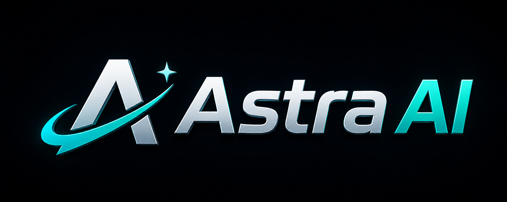

 

# Astra AI

### AI-Powered Crypto Trading Intelligence Dashboard

Astra AI is a smart crypto trading dashboard that helps users monitor the market, analyze trading signals, plan futures setups, and practice trading safely using paper trading.

Built **100% with MuleRun AI**, Astra AI uses **Bitget market data** as its core engine and combines multiple trading tools into one seamless workflow.

---

## Overview

Think of Astra AI as an **all-in-one trading assistant**.

Instead of opening multiple websites for charts, signals, news, sentiment, and trade simulation, Astra AI brings everything together in one dashboard.

It helps users:

- Monitor live market movements  
- Analyze trading signals  
- Generate futures trade setups  
- Simulate trades without real money  
- Review past trading decisions  

This makes trading analysis faster, cleaner, and easier to understand.

---

## Core Features

Astra AI provides multiple modules designed for different trading workflows:

| Module | Purpose |
|---|---|
| Markets | Monitor price movement and market activity |
| Signal Lab | Analyze trading signals using technical indicators |
| Futures | Generate futures trade setups and scenarios |
| Portfolio | Spot Market Assets |
| Meme Hunter | Discover trending meme coins |
| News | Read crypto news and sentiment updates |
| History | Review previous signals and trades |
| Help | Product guidance and usage tips |

---

## Product Vision

The goal of Astra AI is simple:

**Give traders one workspace for everything.**

A trader usually needs multiple tools to:

- Find opportunities  
- Analyze charts  
- Plan entries and exits  
- Simulate trades  
- Evaluate performance  

Astra AI combines all of those into one platform.

This allows users to move from **market discovery → signal analysis → trade setup → paper trading → review** without switching tools.

---

## Project Link

### Astra AI Dashboard 
**https://8s6yjmel.mule.page**

---

## Paper Trading

Paper Trading allows users to simulate real trades without risking actual money.

Useful for:
- Strategy testing
- Risk management practice
- Performance evaluation

---

## Paper Trading History

| History |
|---|
| [Paper Trading History](docs/astra-paper-trades-1782315118564.csv) |
| [Paper Trading History](docs/astra-paper-trades-1782370694668.csv) |
| [Paper Trading History](docs/astra-paper-trades-1782448446434.csv) |
| [Paper Trading History 26-06-2026](docs/astra-paper-trades-1782524962204.csv) |

---

## Trade Statistics

| Metric | Value |
|---|---|
| Total Trades | 7 |
| Win Rate | 85.7% |
| Net PnL | $165.43 |
| Best Trade | BTC +$131.08 |

These statistics help users evaluate strategy performance and improve decision-making.

---

## Signal History

| History |
|---|
| [Signal History](docs/astra-history-1782315898323.csv) |
| [Signal History](docs/astra-history-1782370802826.csv) |
| [Signal History](docs/astra-history-1782448442680.csv) |
| [Signal History 26-06-2026](docs/astra-history-1782523417351.csv) |

Signal history stores previous AI-generated trading analyses for future review.

---

## Tech Stack

| Layer | Stack |
|---|---|
| Build Approach | MuleRun-driven web workflow |
| Market Data Core | Bitget Public APIs |
| Metadata | CoinGecko + sentiment sources |
| Token Discovery | DexScreener |
| Security Check | GoPlus + Honeypot detection |

---

## Bitget API Sources

Astra AI uses Bitget APIs to fetch market data and generate trading insights.

| Category | Endpoint | Purpose |
|---|---|---|
| Market Data | `GET /spot/market/tickers` | Market scanning and rankings |
| Market Data | `GET /spot/market/candles` | Historical chart data |
| Discovery | `GET /spot/public/symbols` | New listings |
| Futures | `GET /mix/market/ticker` | Futures market metrics |
| Funding | `GET /mix/history-fund-rate` | Funding rate analysis |
| Sentiment | `GET /mix/account-long-short` | Long/short market sentiment |

---

## Development Logs

Track the development progress and improvement journey of Astra AI.

| Source | Logs |
|---|---|
| MuleRun | [View Logs](logs/mulerun_logs.md) |

---
