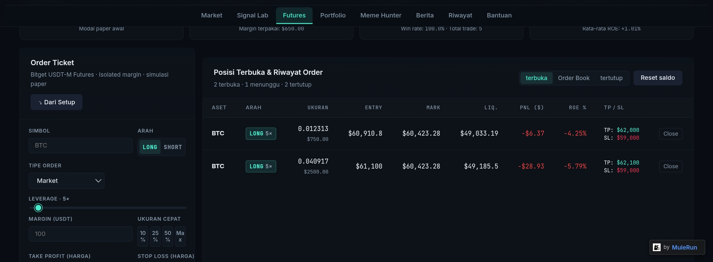
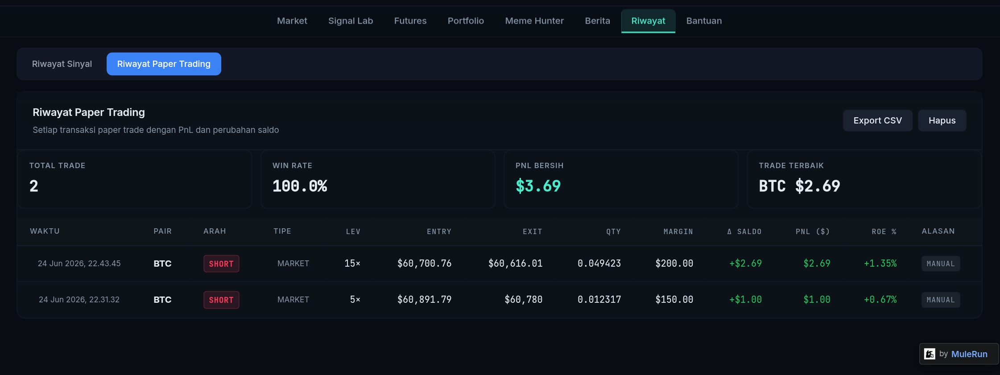

# Astra AI

AI-powered crypto trading intelligence dashboard for market monitoring, multi-factor signal analysis, futures setup generation, paper trading simulation, and cross-module activity logging. The project is presented as a 100% MuleRun-built web product with Bitget market integration at its core, supported by a static frontend and an Express backend that deliver trading workflows and market intelligence features.

## Overview

Astra AI is designed as more than a price dashboard. The project combines a market terminal, explainable signal engine, futures setup assistant, paper trading simulator, news intelligence layer, and historical action logging into one product workflow

From the main navigation alone, the application exposes dedicated modules for Markets, Signal Lab, Futures, Portfolio, Meme Hunter, News, History, and Help, which makes the repository read like a productized trading assistant rather than a simple charting demo. The backend further reinforces this by exposing API routes for signal generation, multi-timeframe confluence, scenarios, backtests, deep analysis, position sizing, movers/losers, token security review, CoinGecko fundamentals, and Bitget-derived market data.

## Product Vision

The project appears to target traders who want one workspace for discovery, analysis, planning, simulation, and review. Instead of splitting those tasks across separate tools, Astra AI keeps them in a single interface where users can move from watchlist monitoring to signal inspection, then into setup generation and paper trade execution.

This design direction is visible in the shared data model as well. The frontend persists watchlists, trades, alerts, positions, balance, and history in browser storage, while the server remains stateless and focused on fetching, computing, and returning market intelligence on demand

# Project Link

| Project | [**ASTRA AI***](https://8s6yjmel.mule.page/) |

## Paper Trading
 

## Paper Trading History 
 

[Paper Trading History](docs/astra-paper-trades-1782315118564.csv) 

[Paper Trading History](docs/astra-paper-trades-1782370694668.csv)

## Trade Statistics

| Metric | Value |
|---|---:|
| Total trades | 3 |
| Win rate | 100.0% |
| Net PnL | $30.28 |
| Best trade | BTC $26.59 |

## Signal History 

[Signal History](docs/astra-history-1782315898323.csv) 

[Signal History](docs/astra-history-1782370802826.csv)

## Tech Stack

| Layer | Stack |
|---|---|
| Build Approach | MuleRun-driven web build workflow  |
| Market Data Core | Bitget public APIs  |
| Metadata and Context | CoinGecko, alternative sentiment/global sources  |
| Token Discovery | DexScreener  |
| Token Security | GoPlus, Honeypot-style audit integration  |

## Bitget API Sources

| Category | Endpoint | Purpose |
|---|---|---|
| Market Data | `GET /api/v2/spot/market/tickers?symbol=...` | Single-asset spot ticker data |
| Market Data | `GET /api/v2/spot/market/tickers` | Full spot market scan, ranking, gainers, and losers |
| Market Data | `GET /api/v2/spot/market/candles?symbol=...&granularity=...&limit=...` | Historical spot candles for technical analysis |
| Market Data | `GET /api/v2/spot/public/symbols` | New listings and symbol discovery |
| Futures Data | `GET /api/v2/mix/market/ticker?symbol=...&productType=USDT-FUTURES` | Futures ticker, funding rate, open interest, and mark price |
| Futures Data | `GET /api/v2/mix/market/history-fund-rate?symbol=...&productType=USDT-FUTURES&pageSize=...` | Historical funding rate analysis |
| Sentiment and Positioning | `GET /api/v2/mix/market/account-long-short?symbol=...&productType=USDT-FUTURES&period=...` | Long-short ratio for positioning and sentiment context |

